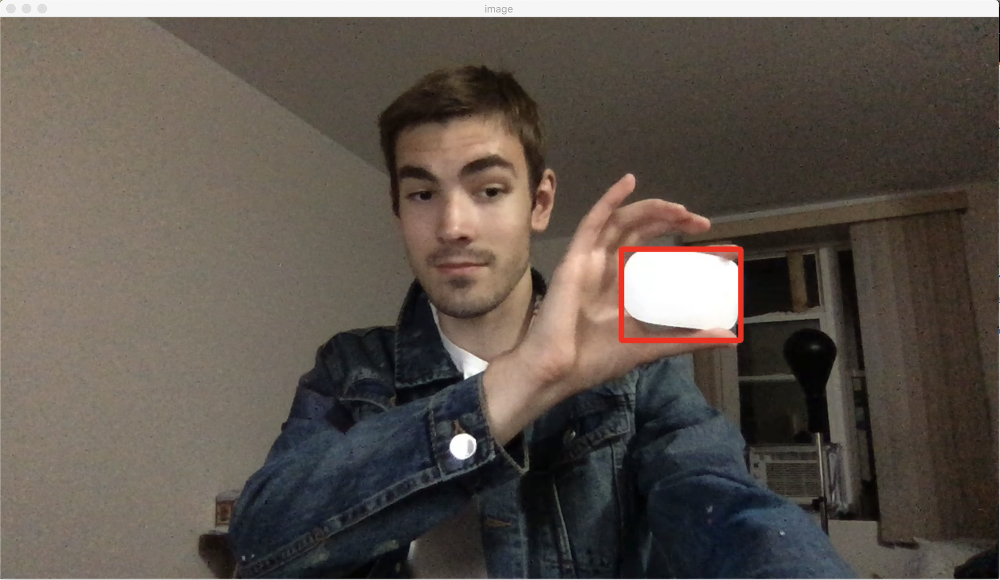

# Golf-Roomba-Project
A golf roomba? This search and destroy robot will find golf balls that are just lying around the course for you to break your neck on, and will eliminate the threat by sucking them up. Like a vacuum.

**cam.py**: test code using a laptop webcam, uses color mask to detect objects that are the color white (ie. a pesky little golf ball) and tracks said detected ball with a box using opencv 👍

Robot and robot code to come when I actually make it..
